# cloud-project

##### 以 vue 框架来搭建的项目，主要内容是 js 动画 css 动画，es6 等编码方式。

| 成分     | 占比 |
| -------- | ---- |
| VUE      | 100% |
| Canvas   | ~80% |
| JS       | ~85% |
| Html+Css | ~10% |

### 一些内容

#### 1、使用 canvas 动画较多、css 动画较少

#### 2、canvas 动画离屏绘制，节俭性能

#### 3、动画执行器 requestAnimationFrame 所执行的内容集中控制。在一个组件内部调用，其他组件将 方法 和 参数 提交到父组件，由父组件统一执行。

###### 执行

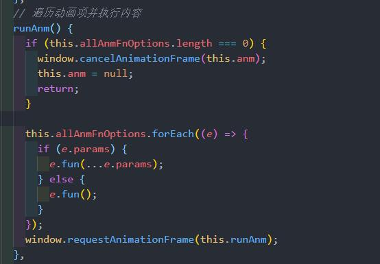

###### 动画项管理

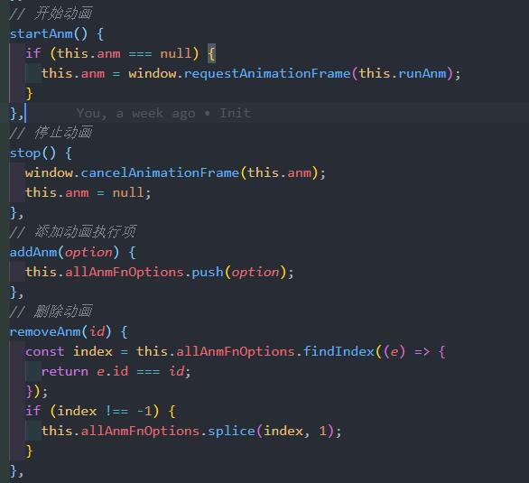

###### 监听，自动开始结束动画

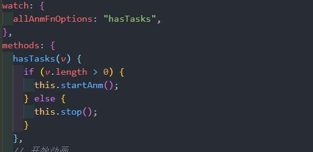

###### 例：星星背景动画，子组件动画方法及参数提交到父组件

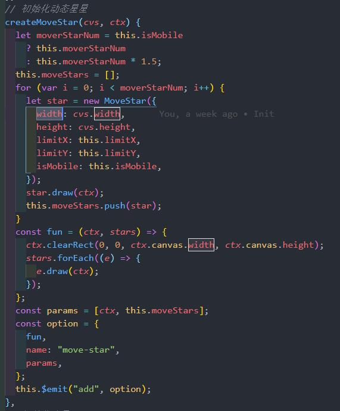

###### 移动类型的星星构造函数

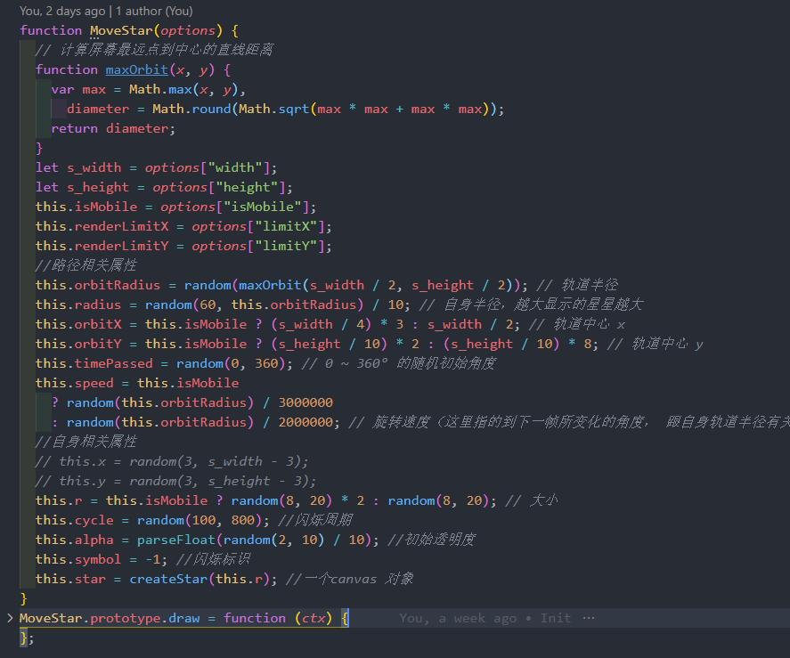

#### 4、动画类型模块化

###### 各个动画类

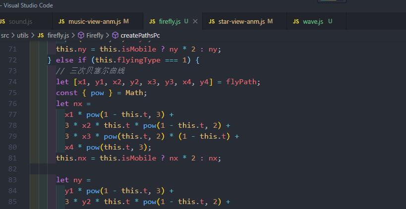

###### 封装 AudioContext 基础方法实现音频播放器

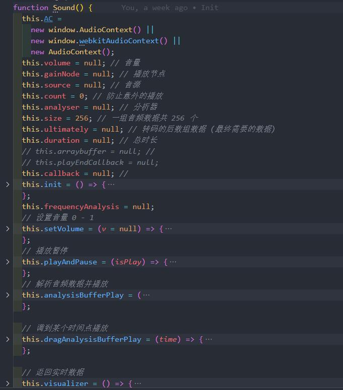

###### 封装 音频可视化动画三种动画

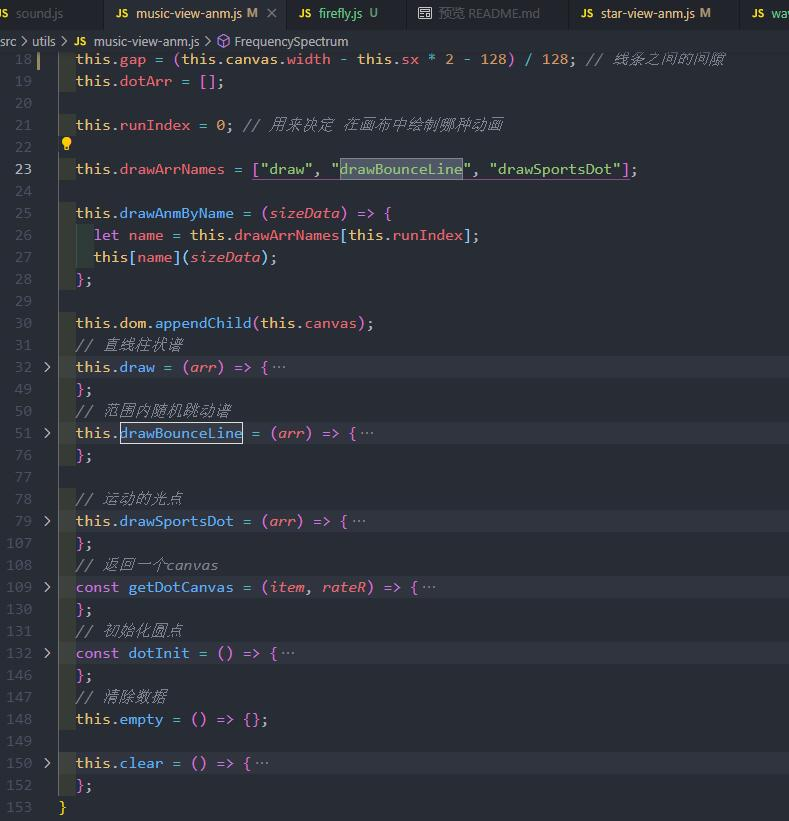

###### 封装 让图片水波化的动画

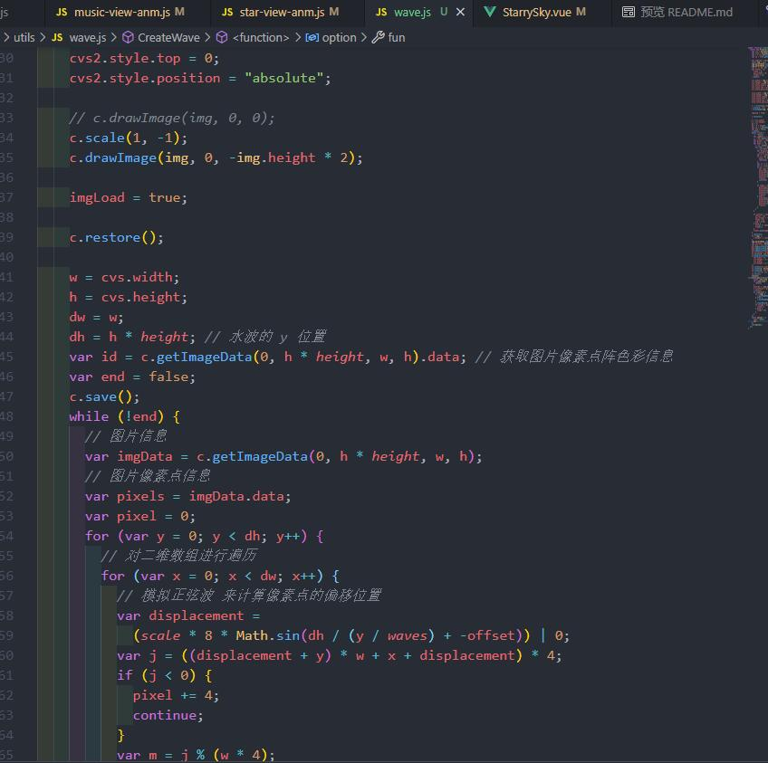

###### 封装 三种星星函数 （流星可做性能优化，已想到，未优化）

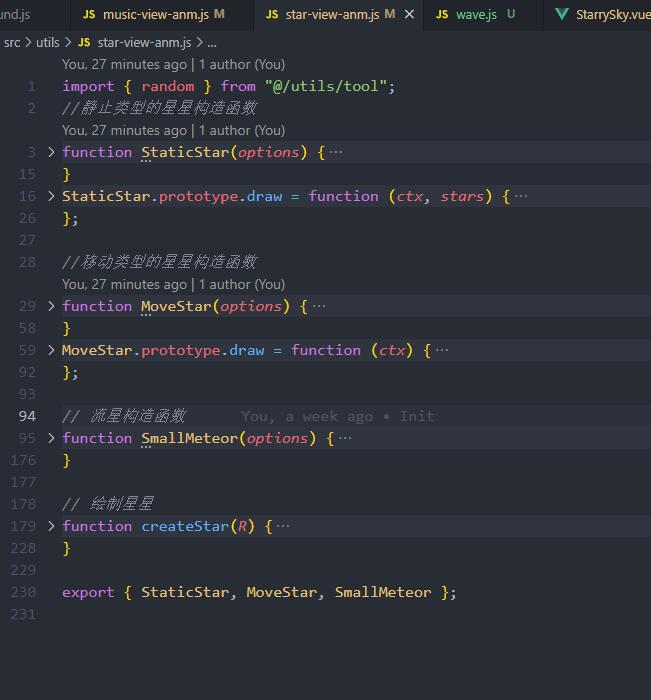

###### 封装 萤火虫动画函数 （移动端萤火虫路径可做动画优化，待尝试）

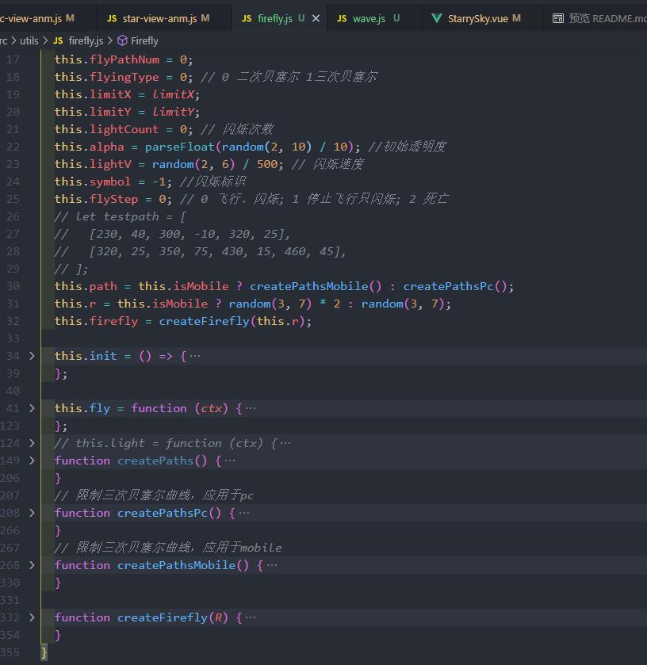

## Project setup

```
npm install
```

### Compiles and hot-reloads for development

```
npm run serve
```

### Compiles and minifies for production

```
npm run build
```

### Lints and fixes files

```
npm run lint
```

### Customize configuration

See [Configuration Reference](https://cli.vuejs.org/config/).
